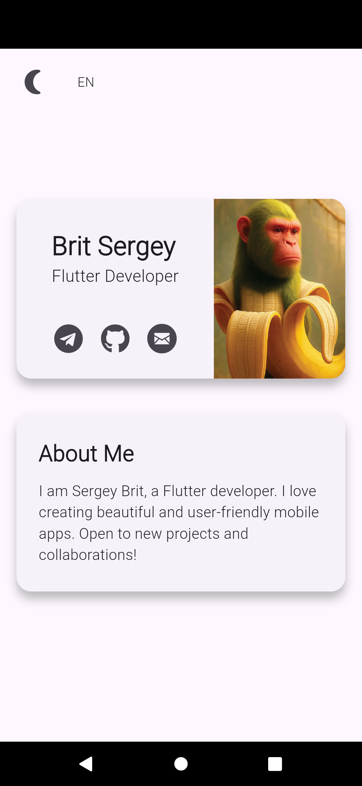
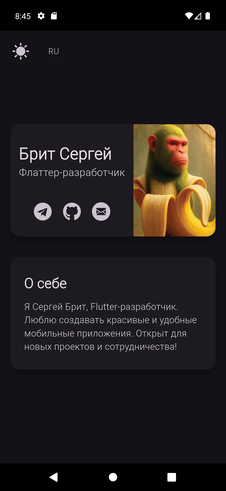

# viitka_final

**viitka_final** — это кроссплатформенное CV-приложение, разработанное на Flutter. Позволяет красиво и удобно представить информацию о себе, навыках и контактах. Поддерживает светлую и тёмную темы, а также два языка: русский и английский.

## О проекте

- Автор: Брит Сергей
- Назначение: Визитка/резюме Flutter-разработчика
- Поддержка языков: 🇷🇺 Русский, 🇬🇧 English
- Платформы: Android, iOS, Windows, macOS, Web

## Скриншоты

| Светлая тема и русский язык | Тёмная тема и английский язык |
|--------------|--------|
|  |  |

## Установка и запуск

1. Клонируйте репозиторий:
   ```sh
   git clone https://github.com/Louert/vizitka_final.git
   cd vizitka_final
   ```
2. Установите зависимости:
   ```sh
   flutter pub get
   ```
3. Запустите приложение:
   ```sh
   flutter run
   ```

## Структура проекта

- `lib/main.dart` — точка входа, настройка темы, локализации, роутинг.
- `lib/l10n/` — локализационные файлы (русский и английский).
- `lib/app_theme.dart` — оформление приложения.
- `lib/cv_icons.dart`, `icons/` — кастомные иконки.
- `lib/error_handler.dart`, `lib/logger.dart` — обработка ошибок и логирование.
- `assets/` — изображения (например, аватар).
- `fonts/` — кастомные шрифты.
- `packages/ui_components/` — собственные UI-компоненты (карточки, текст, иконки).
- `screenshots/` — скриншоты для README.

## Кастомные компоненты

В проекте используются собственные компоненты из пакета `ui_components`:
- `CVCardContainer` — контейнер для карточки резюме
- `LinkIcon` — иконка-ссылка
- `AppText` — стилизованный текст

## Зависимости

- `flutter`
- `flutter_localizations`
- `url_launcher`
- `logging`
- `ui_components` (локальный пакет)

## Локализация

Приложение поддерживает два языка: русский и английский. Переключение языка осуществляется прямо из интерфейса.

---

> © Брит Сергей, 2024

